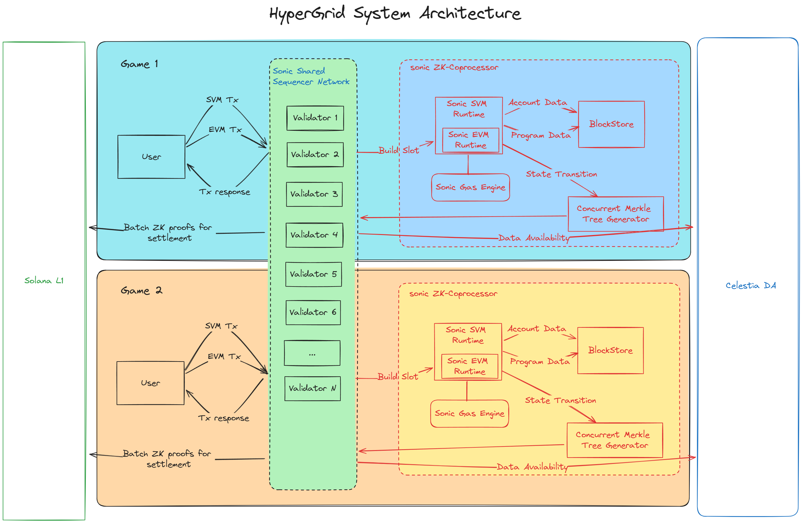
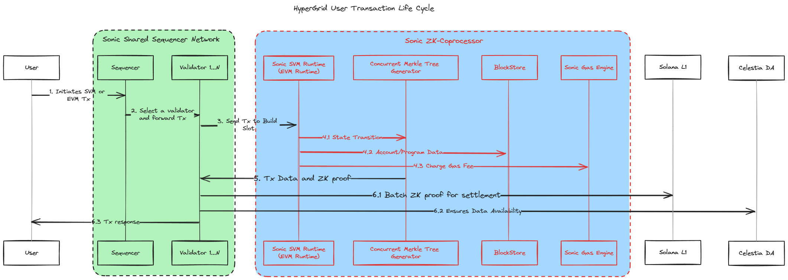

# HyperGrid: A Scalable Infrastructure for Solana Ecosystem

Solana's blockchain, renowned for its high throughput capabilities, encounters limitations as the demand for decentralized applications (dApps) escalates. HyperGrid addresses these constraints by providing a scalable framework that enhances the existing infrastructure without compromising on decentralization or security.

## Architectural Overview

HyperGrid's architecture is predicated on a multi-grid approach, wherein each grid operates semi-autonomously while remaining anchored to the Solana mainnet for consensus and finality. This section will dissect the structural elements and their interrelations.

## Transaction Processing Lifecycle

The Transaction Processing Lifecycle in HyperGrid is a well-orchestrated series of events that ensure the swift and secure handling of user transactions from initiation to settlement.

